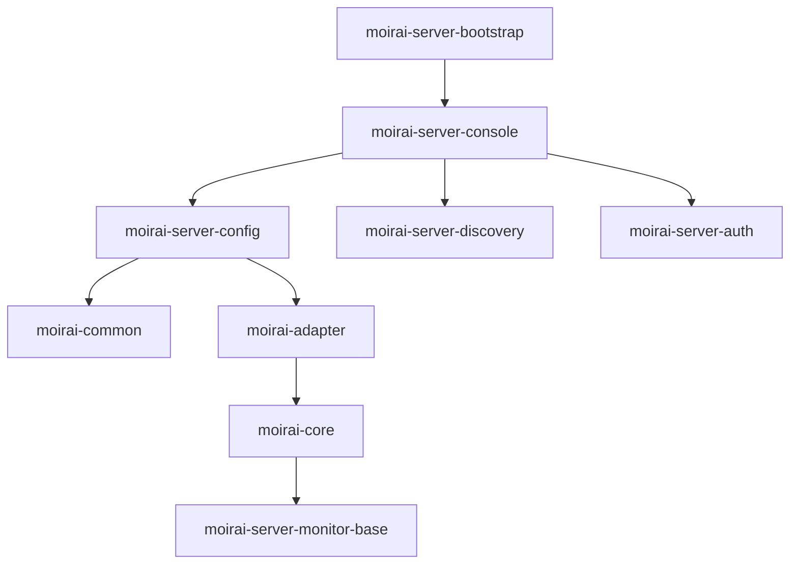

# Moirai
Moirai 是一个参考 Hippo4j 写的动态线程池框架，核心逻辑与 Hippo4j 一致，主要用于个人学习，在亲手造轮子中学习 Hippo4j 源码，以及学习动态线程池的设计原理与编码实践。

除了框架本身以外，本仓库还较为系统性整理了动态线程池相关的知识，欢迎交流。

## maven 依赖关系（project module）
```
moirai-server-bootstrap 
└── moirai-server-console 
    ├── moirai-server-config
    │   ├── moirai-common 
    │   └── moirai-adapter 
    │       └── moirai-core 
    │           └── moirai-server-monitor-base 
    ├── moirai-server-discovery 
    └── moirai-server-auth 
```


1. 根节点是 `moirai-server-bootstrap`
2. 直接依赖是 `moirai-server-console`（编译作用域）
3. 二级依赖包含三个模块： 
   - 配置模块 `moirai-server-config`
   - 服务发现模块 `moirai-server-discovery`
   - 认证模块 `moirai-server-auth`
4. 配置模块延伸出基础技术栈：
   - 公共模块 → 适配器 → 核心模块 → 监控基础模块





## 目录
### 线程池相关
+ [为什么Java要设计一个线程池？](https://github.com/PansonPanson/moirai/blob/main/doc/001_Java%E4%B8%BA%E4%BB%80%E4%B9%88%E8%A6%81%E8%AE%BE%E8%AE%A1%E7%BA%BF%E7%A8%8B%E6%B1%A0%EF%BC%9F.md)
+ [万字长文之线程池源码深入分析](https://github.com/PansonPanson/moirai/blob/main/doc/002_%E7%BA%BF%E7%A8%8B%E6%B1%A0%E6%BA%90%E7%A0%81%E6%B7%B1%E5%85%A5%E5%88%86%E6%9E%90.md)
+ [线程池源码涉及到的位运算以及相应算法练习](https://github.com/PansonPanson/moirai/blob/main/doc/%E7%BA%BF%E7%A8%8B%E6%B1%A0%E6%BA%90%E7%A0%81%E6%B6%89%E5%8F%8A%E5%88%B0%E7%9A%84%E4%BD%8D%E8%BF%90%E7%AE%97%E4%BB%A5%E5%8F%8A%E7%9B%B8%E5%BA%94%E7%AE%97%E6%B3%95%E7%BB%83%E4%B9%A0.md) 
+ [线程池源码涉及到的链表结构以及相应算法练习](https://github.com/PansonPanson/moirai/blob/main/doc/%E7%BA%BF%E7%A8%8B%E6%B1%A0%E6%BA%90%E7%A0%81%E6%B6%89%E5%8F%8A%E5%88%B0%E7%9A%84%E9%93%BE%E8%A1%A8%E7%BB%93%E6%9E%84%E4%BB%A5%E5%8F%8A%E7%9B%B8%E5%BA%94%E7%AE%97%E6%B3%95%E7%BB%83%E4%B9%A0.md)
+ [LinkedBlockingQueue 原理与源码深度分析](https://github.com/PansonPanson/moirai/blob/main/doc/LinkedBlockingQueue%20%E5%8E%9F%E7%90%86%E4%B8%8E%E6%BA%90%E7%A0%81%E6%B7%B1%E5%BA%A6%E5%88%86%E6%9E%90.md)
+ [核心线程数为0时，线程池如何执行？](https://github.com/PansonPanson/moirai/blob/main/doc/%E6%A0%B8%E5%BF%83%E7%BA%BF%E7%A8%8B%E6%95%B0%E4%B8%BA%200%20%E6%97%B6%EF%BC%8C%E7%BA%BF%E7%A8%8B%E6%B1%A0%E5%A6%82%E6%9E%9C%E6%89%A7%E8%A1%8C%E4%BB%BB%E5%8A%A1%EF%BC%9F.md) 
+ [线程池中那些信息是可以被监控的？](https://github.com/PansonPanson/moirai/blob/main/doc/%E7%BA%BF%E7%A8%8B%E6%B1%A0%E4%B8%AD%E5%93%AA%E4%BA%9B%E4%BF%A1%E6%81%AF%E6%98%AF%E5%8F%AF%E4%BB%A5%E8%A2%AB%E7%9B%91%E6%8E%A7%E7%9A%84%EF%BC%9F.md)
+ [线程池异常后：销毁还是复用](https://github.com/PansonPanson/moirai/blob/main/doc/%E7%BA%BF%E7%A8%8B%E6%B1%A0%E5%BC%82%E5%B8%B8%E5%90%8E%E6%98%AF%E8%A2%AB%E9%94%80%E6%AF%81%E8%BF%98%E6%98%AF%E5%A4%8D%E7%94%A8%EF%BC%9F.md) 
+ [线程池的核心线程会被回收吗？](https://github.com/PansonPanson/moirai/blob/main/doc/%E7%BA%BF%E7%A8%8B%E6%B1%A0%E7%9A%84%E6%A0%B8%E5%BF%83%E7%BA%BF%E7%A8%8B%E4%BC%9A%E8%A2%AB%E5%9B%9E%E6%94%B6%E5%90%97%EF%BC%9F.md)
+ [线程池提交一个任务占多大内存？](https://github.com/PansonPanson/moirai/blob/main/doc/%E7%BA%BF%E7%A8%8B%E6%B1%A0%E6%8F%90%E4%BA%A4%E4%B8%80%E4%B8%AA%E4%BB%BB%E5%8A%A1%E5%8D%A0%E5%A4%9A%E5%A4%A7%E5%86%85%E5%AD%98%EF%BC%9F.md) 
+ [如何保证服务器宕机后线程池不丢失数据?](https://github.com/PansonPanson/moirai/blob/main/doc/%E5%A6%82%E4%BD%95%E4%BF%9D%E8%AF%81%E6%9C%8D%E5%8A%A1%E5%99%A8%E5%AE%95%E6%9C%BA%E5%90%8E%E7%BA%BF%E7%A8%8B%E6%B1%A0%E4%B8%8D%E4%B8%A2%E5%A4%B1%E6%95%B0%E6%8D%AE%EF%BC%9F.md)
+ [如何设计一个线程池](https://github.com/PansonPanson/moirai/blob/main/doc/%E5%A6%82%E4%BD%95%E4%BF%9D%E8%AF%81%E6%9C%8D%E5%8A%A1%E5%99%A8%E5%AE%95%E6%9C%BA%E5%90%8E%E7%BA%BF%E7%A8%8B%E6%B1%A0%E4%B8%8D%E4%B8%A2%E5%A4%B1%E6%95%B0%E6%8D%AE%EF%BC%9F.md)
+ [FutureTask源码深入分析？.md](doc/FutureTask%E6%BA%90%E7%A0%81%E6%B7%B1%E5%85%A5%E5%88%86%E6%9E%90%EF%BC%9F.md)
+ [虚拟线程原理及性能分析.md](doc/%E8%99%9A%E6%8B%9F%E7%BA%BF%E7%A8%8B%E5%8E%9F%E7%90%86%E5%8F%8A%E6%80%A7%E8%83%BD%E5%88%86%E6%9E%90.md) 
+ [ForkJoinPool 源码深入分析？.md](doc/ForkJoinPool%20%E6%BA%90%E7%A0%81%E6%B7%B1%E5%85%A5%E5%88%86%E6%9E%90%EF%BC%9F.md)[ForkJoinPool 源码深入分析？.md]()
+ Spring 的线程池设计 
  + Spring中Async注解底层异步线程池原理 
+ Dubbo 的线程池设计 
+ RocketMQ 的线程池设计 
+ 时间轮
+ [Tomcat 对 jdk 线程池进行了哪些修改？.md](doc/Tomcat%20%E5%AF%B9%20jdk%20%E7%BA%BF%E7%A8%8B%E6%B1%A0%E8%BF%9B%E8%A1%8C%E4%BA%86%E5%93%AA%E4%BA%9B%E4%BF%AE%E6%94%B9%EF%BC%9F.md)

### Spring 相关
+ [DisposableBean 作用与原理](https://github.com/PansonPanson/moirai/blob/main/doc/DisposableBean%E4%BD%9C%E7%94%A8%E4%B8%8E%E5%8E%9F%E7%90%86.md)
+ [如何自定义一个 SpringBoot starter ?.md](doc/%E5%A6%82%E4%BD%95%E8%87%AA%E5%AE%9A%E4%B9%89%E4%B8%80%E4%B8%AA%20SpringBoot%20starter%3F.md)
+ 

### 如何设计一个动态线程池框架？
+ 明确监控的线程池信息（直接读取的核心参数、加工后的数据）
+ 支持第三方线程池（transmittable-thread-local、Spring ThreadPoolTaskExecutor……）
+ 客户端上报动态线程池配置信息到服务端
+ 客户端收集并上报动态线程池运行时信息到服务端
+ 客户端根据服务端通知，动态刷新本地线程池配置
+ 服务发现
+ 续约
+ 故障移除
+ 告警机制
+ 长轮询，实现线程池配置信息的动态变更
+ ……

### 进一步优化
+ 

