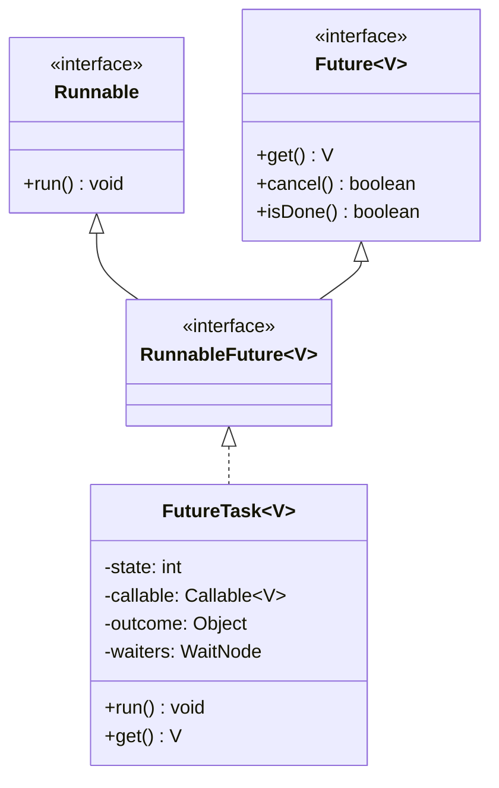
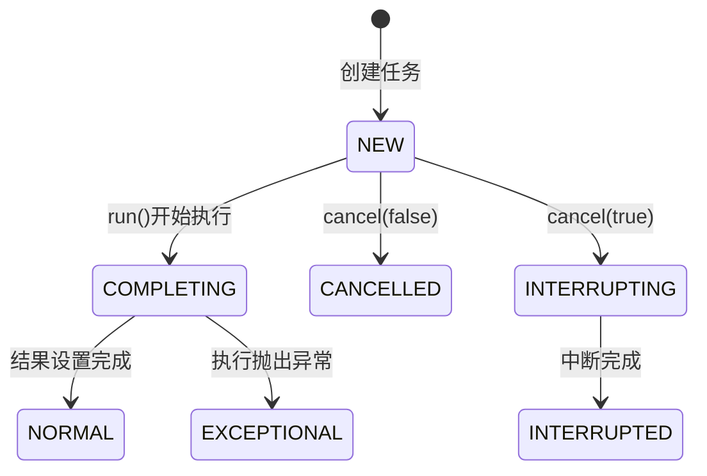

---

### FutureTask 原理与源码解析：异步计算的桥梁

---

#### 一、FutureTask 的定位与核心价值

在 Java 并发编程中，`FutureTask` 是一个将 **任务执行** 与 **结果获取** 解耦的经典设计。它既是一个 `Runnable`（可被线程执行），也是一个 `Future`（可获取异步计算结果），这种双重身份使其成为连接任务提交者与执行线程的桥梁。
其核心价值在于：
- **异步计算管理**：允许调用线程在任务执行期间去做其他工作，通过轮询或阻塞等待获取结果。
- **结果状态封装**：通过状态机模型统一管理任务的 **未启动**、**已完成**、**已取消** 等状态。

---

#### 二、类继承关系与角色定位

##### 1. 类继承图

- **关键接口关系**：
    - `Runnable`：定义任务执行入口 `run()`。
    - `Future`：定义结果获取、任务取消等操作。
    - `RunnableFuture`：整合两者，表示一个可执行的异步计算任务。

##### 2. 核心字段
```java
// FutureTask 源码中的关键字段
private volatile int state;           // 任务状态（NEW, COMPLETING, NORMAL, etc.）
private Callable<V> callable;        // 实际执行的任务（最终会被置为null）
private Object outcome;              // 计算结果或异常对象
private volatile WaitNode waiters;    // 等待结果的线程链表
```

---

#### 三、状态机模型：任务生命周期的核心

##### 1. 状态定义
```java
// FutureTask 的状态常量
private static final int NEW          = 0; // 初始状态
private static final int COMPLETING   = 1; // 任务即将完成（结果暂存中）
private static final int NORMAL       = 2; // 任务正常完成（结果已设置）
private static final int EXCEPTIONAL  = 3; // 任务执行抛出异常
private static final int CANCELLED    = 4; // 任务被取消（未执行）
private static final int INTERRUPTING = 5; // 中断进行中（仅当取消时请求中断）
private static final int INTERRUPTED  = 6; // 任务被中断（最终状态）
```
- **状态转换图**：


##### 2. 状态流转示例
- **正常执行流程**：
  `NEW → COMPLETING → NORMAL`
- **执行中取消**：
  `NEW → INTERRUPTING → INTERRUPTED`
- **执行抛出异常**：
  `NEW → COMPLETING → EXCEPTIONAL`

---

#### 四、核心方法源码解析

##### 1. 任务执行入口：`run()`
```java
public void run() {
    if (state != NEW || !UNSAFE.compareAndSwapObject(this, runnerOffset, null, Thread.currentThread()))
        return; // 状态校验与线程CAS绑定
  
    try {
        Callable<V> c = callable;
        if (c != null && state == NEW) {
            V result;
            boolean ran;
            try {
                result = c.call(); // 执行实际任务
                ran = true;
            } catch (Throwable ex) {
                result = null;
                ran = false;
                setException(ex); // 异常处理
            }
            if (ran)
                set(result); // 结果设置
        }
    } finally {
        runner = null; // 解除线程绑定
        if (state == INTERRUPTING)
            handlePossibleCancellationInterrupt(); // 处理中断
    }
}
```
- **关键操作**：
    - **CAS绑定线程**：确保同一时刻只有一个线程执行任务。
    - **结果/异常处理**：通过 `set()` 或 `setException()` 更新状态和结果。
    - **中断补偿**：若任务被中断，确保中断状态被正确设置。

##### 2. 结果获取：`get()`
```java
public V get() throws InterruptedException, ExecutionException {
    int s = state;
    if (s <= COMPLETING) // 任务未完成
        s = awaitDone(false, 0L); // 阻塞等待
    return report(s); // 解析结果
}

private int awaitDone(boolean timed, long nanos) {
    WaitNode node = new WaitNode(); // 创建等待节点
    for (;;) {
        if (Thread.interrupted()) {
            removeWaiter(node); // 处理中断
            throw new InterruptedException();
        }
        int s = state;
        if (s > COMPLETING) { // 任务已完成或取消
            node.thread = null;
            return s;
        }
        if (s == COMPLETING) // 短暂等待结果设置完成
            Thread.yield();
        else {
            node.next = waiters; // 将当前线程加入等待链表
            if (UNSAFE.compareAndSwapObject(this, waitersOffset, node.next, node)) {
                LockSupport.park(this); // 挂起线程（等待唤醒）
            }
        }
    }
}
```
- **等待队列管理**：
    - **链表结构**：通过 `WaitNode` 维护等待线程的链表（类似 AQS 的 CLH 队列）。
    - **线程挂起**：使用 `LockSupport.park()` 实现无锁阻塞。
- **唤醒机制**：当任务完成（`set()`）或取消时，调用 `finishCompletion()` 遍历链表唤醒所有等待线程。

##### 3. 结果设置：`set()`
```java
protected void set(V v) {
    if (UNSAFE.compareAndSwapInt(this, stateOffset, NEW, COMPLETING)) {
        outcome = v; // 暂存结果
        UNSAFE.putOrderedInt(this, stateOffset, NORMAL); // 最终状态更新
        finishCompletion(); // 唤醒所有等待线程
    }
}
```
- **原子性保障**：通过 CAS 操作确保状态从 `NEW` 转换到 `COMPLETING`。
- **内存可见性**：`putOrderedInt` 保证 `outcome` 写入对其他线程可见。

---

#### 五、设计哲学与工程启示

##### 1. 状态与行为的解耦
- **状态驱动**：所有方法的行为均由当前状态决定（如 `get()` 在未完成时阻塞）。
- **无锁化设计**：通过 CAS 和 `volatile` 实现线程安全，避免重量级锁带来的性能损耗。

##### 2. 等待链表的精妙设计
- **高效唤醒**：任务完成后一次性唤醒所有等待线程，减少上下文切换。
- **避免“惊群效应”**：每个线程在唤醒后自行检查状态，确保逻辑正确。

##### 3. 对中断的精细化处理
- **中断补偿**：在 `cancel(true)` 时确保中断信号传递到执行线程。
- **中断响应**：在 `get()` 中及时抛出 `InterruptedException`，避免线程无谓等待。

---

#### 六、总结

`FutureTask` 的设计体现了 Java 并发编程的经典范式：
- **封装复杂性**：通过状态机和原子操作隐藏了异步计算的并发细节。
- **资源高效**：无锁设计减少竞争，等待链表避免资源浪费。
- **扩展性**：可通过子类化定制任务行为（如 `ScheduledFutureTask`）。

理解其源码不仅能掌握异步编程的核心机制，更能从中学习到如何在高性能与代码简洁性之间找到平衡。正如其作者 Doug Lea 所言：“并发编程的艺术在于管理复杂性”，而 `FutureTask` 正是这一理念的绝佳实践。