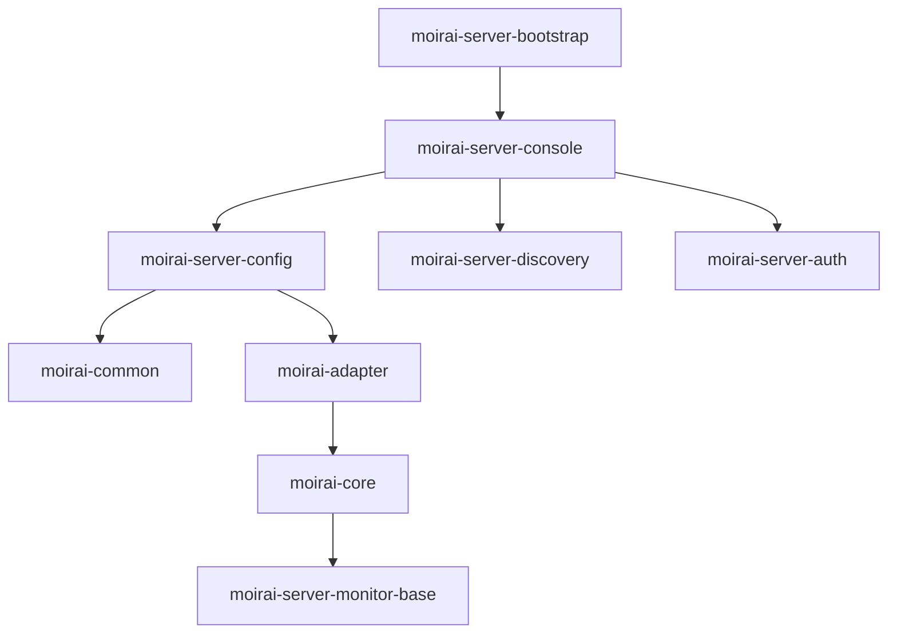

# maven 依赖关系（project module）

```
moirai-server-bootstrap (0.0.1-SNAPSHOT)
└── moirai-server-console (compile)
    ├── moirai-server-config (compile)
    │   ├── moirai-common (compile)
    │   └── moirai-adapter (compile)
    │       └── moirai-core (compile)
    │           └── moirai-server-monitor-base (compile)
    ├── moirai-server-discovery (compile)
    └── moirai-server-auth (compile)
```


1. 根节点是 `moirai-server-bootstrap`
2. 直接依赖是 `moirai-server-console`（编译作用域）
3. 二级依赖包含三个模块：
    - 配置模块 `moirai-server-config`
    - 服务发现模块 `moirai-server-discovery`
    - 认证模块 `moirai-server-auth`
4. 配置模块延伸出基础技术栈：
    - 公共模块 → 适配器 → 核心模块 → 监控基础模块



