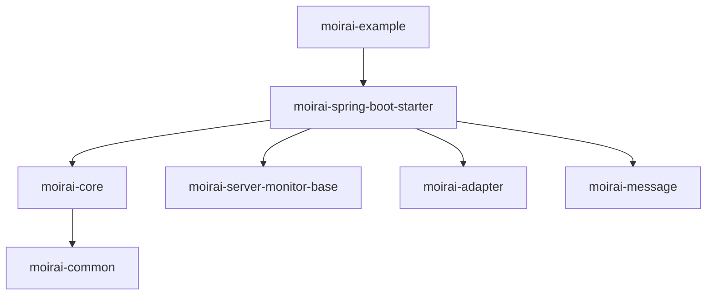

依赖关系图：

### 关键特征：
1. **层级结构**：
    - Level 0: 根模块 `moirai-example`
    - Level 1: 核心依赖 `moirai-spring-boot-starter`
    - Level 2: Starter 的四个直接子模块
    - Level 3: `moirai-core` 的唯一子模块 `moirai-common`
