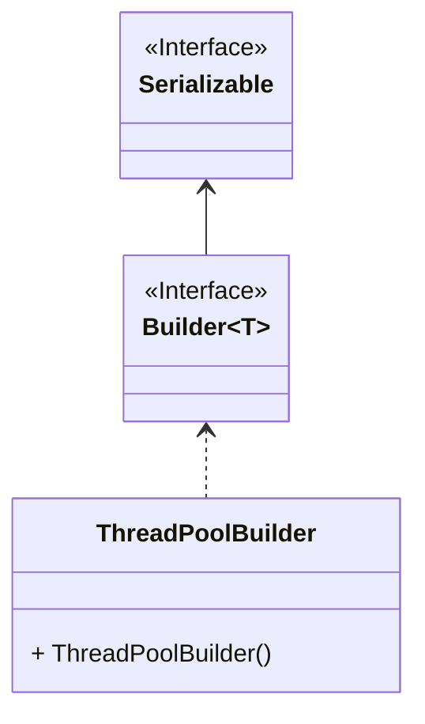

```java

/**
 *
 * @方法描述：线程池构建器
 */
public class ThreadPoolBuilder implements Builder<ThreadPoolExecutor> {

    //这个表示线程池构建器是否要创建快速线程池，快速线程池就是执行任务比较快一点的线程池
    private boolean isFastPool;

    //表示这个线程池构建器是否要创建动态线程池
    private boolean isDynamicPool;

    //得到线程池的核心线程数量，这个数量是根据CPU核心数量计算出来的
    private int corePoolSize = calculateCoreNum();

    //线程池最大线程数量
    private int maxPoolSize = corePoolSize + (corePoolSize >> 1);

    //存活时间
    private long keepAliveTime = 30000L;

    //时间单位
    private TimeUnit timeUnit = TimeUnit.MILLISECONDS;

    //执行任务超时时间
    private long executeTimeOut = 10000L;

    //队列容量
    private int capacity = 512;

    //队列类型，默认使用ResizableCapacityLinkedBlockingQueue队列
    private BlockingQueueTypeEnum blockingQueueType = BlockingQueueTypeEnum.RESIZABLE_LINKED_BLOCKING_QUEUE;

    //线程池队列
    private BlockingQueue workQueue;

    //拒绝策略
    private RejectedExecutionHandler rejectedExecutionHandler = new ThreadPoolExecutor.AbortPolicy();

    //是否为守护线程
    private boolean isDaemon = false;

    //线程池现成的前缀名称
    private String threadNamePrefix;

    //创建线程的线程工厂
    private ThreadFactory threadFactory;

    //线程池Id
    private String threadPoolId;

    //线程池要执行的任务的装饰器，这个装饰器很有用，是一个挺好的扩展点
    //在这个装饰器的包装下，用户可以在线程池要执行的真正任务之前做一些额外的操作
    //在这个动态线程池框架中， 有一个TaskTraceBuilderHandler对象，这就是一个装饰器对象
    //在它的包装下，在每一个任务执行之前，都会把任务超时标志放到执行人物的线程中
    //如果线程执行的某个任务超时了，就可以使用这个标志告警通知了
    private TaskDecorator taskDecorator;

    //线程池关闭时，等待剩余任务执行的最大时间
    private Long awaitTerminationMillis = 5000L;

    //线程池关闭时是否等待正在执行的任务执行完毕
    private Boolean waitForTasksToCompleteOnShutdown = true;

    //是否允许超过存活时间的核心线程终止工作
    private Boolean allowCoreThreadTimeOut = false;


    //得到线程池核心线程数量的方法
    private Integer calculateCoreNum() {
        int cpuCoreNum = Runtime.getRuntime().availableProcessors();
        return new BigDecimal(cpuCoreNum).divide(new BigDecimal("0.2")).intValue();
    }


    /**
     *
     * @方法描述：剩下的都是非常简单的方法了，就不添加详细注释了
     */
    public ThreadPoolBuilder isFastPool(Boolean isFastPool) {
        this.isFastPool = isFastPool;
        return this;
    }

    /**
     * Dynamic pool.
     *
     * @return thread-pool builder
     */
    public ThreadPoolBuilder dynamicPool() {
        this.isDynamicPool = true;
        return this;
    }


    /**
     *
     * @方法描述：这个方法需要强调一下，这里给线程池现成的前缀赋值了，后面会用到这个，在创建线程时会这个前缀进行判空操作，如果为空
     * 会操作失败
     */
    public ThreadPoolBuilder threadFactory(String threadNamePrefix) {
        this.threadNamePrefix = threadNamePrefix;
        return this;
    }

    /**
     * Thread factory.
     *
     * @param threadFactory thread factory
     * @return thread-pool builder
     */
    public ThreadPoolBuilder threadFactory(ThreadFactory threadFactory) {
        this.threadFactory = threadFactory;
        return this;
    }

    /**
     * Thread factory.
     *
     * @param threadNamePrefix thread name prefix
     * @param isDaemon         is daemon
     * @return thread-pool builder
     */
    public ThreadPoolBuilder threadFactory(String threadNamePrefix, Boolean isDaemon) {
        this.threadNamePrefix = threadNamePrefix;
        this.isDaemon = isDaemon;
        return this;
    }

    /**
     * Core pool size.
     *
     * @param corePoolSize core pool size
     * @return thread-pool builder
     */
    public ThreadPoolBuilder corePoolSize(int corePoolSize) {
        this.corePoolSize = corePoolSize;
        return this;
    }

    /**
     * Max pool num.
     *
     * @param maxPoolSize max pool num
     * @return thread-pool builder
     */
    public ThreadPoolBuilder maxPoolNum(int maxPoolSize) {
        this.maxPoolSize = maxPoolSize;
        if (maxPoolSize < this.corePoolSize) {
            this.corePoolSize = maxPoolSize;
        }
        return this;
    }

    /**
     * Single pool.
     *
     * @return thread-pool builder
     */
    public ThreadPoolBuilder singlePool() {
        int singleNum = 1;
        this.corePoolSize = singleNum;
        this.maxPoolSize = singleNum;
        return this;
    }

    /**
     * Single pool.
     *
     * @param threadNamePrefix thread name prefix
     * @return thread-pool builder
     */
    public ThreadPoolBuilder singlePool(String threadNamePrefix) {
        int singleNum = 1;
        this.corePoolSize = singleNum;
        this.maxPoolSize = singleNum;
        this.threadNamePrefix = threadNamePrefix;
        return this;
    }

    /**
     * Pool thread size.
     *
     * @param corePoolSize core pool size
     * @param maxPoolSize  max pool size
     * @return thread-pool builder
     */
    public ThreadPoolBuilder poolThreadSize(int corePoolSize, int maxPoolSize) {
        this.corePoolSize = corePoolSize;
        this.maxPoolSize = maxPoolSize;
        return this;
    }

    /**
     * Keep alive time.
     *
     * @param keepAliveTime keep alive time
     * @return thread-pool builder
     */
    public ThreadPoolBuilder keepAliveTime(long keepAliveTime) {
        this.keepAliveTime = keepAliveTime;
        return this;
    }

    /**
     * Time unit.
     *
     * @param timeUnit time unit
     * @return thread-pool builder
     */
    public ThreadPoolBuilder timeUnit(TimeUnit timeUnit) {
        this.timeUnit = timeUnit;
        return this;
    }

    /**
     * Execute time-out.
     *
     * @param executeTimeOut execute time-out
     * @return thread-pool builder
     */
    public ThreadPoolBuilder executeTimeOut(long executeTimeOut) {
        this.executeTimeOut = executeTimeOut;
        return this;
    }

    /**
     * Keep alive time.
     *
     * @param keepAliveTime keep alive time
     * @param timeUnit      time unit
     * @return thread-pool builder
     */
    public ThreadPoolBuilder keepAliveTime(long keepAliveTime, TimeUnit timeUnit) {
        this.keepAliveTime = keepAliveTime;
        this.timeUnit = timeUnit;
        return this;
    }

    /**
     * Capacity.
     *
     * @param capacity capacity
     * @return thread-pool builder
     */
    public ThreadPoolBuilder capacity(int capacity) {
        this.capacity = capacity;
        return this;
    }

    /**
     * Work queue.
     *
     * @param queueType queue type
     * @param capacity  capacity
     * @return thread-pool builder
     */
    public ThreadPoolBuilder workQueue(BlockingQueueTypeEnum queueType, int capacity) {
        this.blockingQueueType = queueType;
        this.capacity = capacity;
        return this;
    }

    /**
     * Rejected.
     *
     * @param rejectedExecutionHandler rejected execution handler
     * @return thread-pool builder
     */
    public ThreadPoolBuilder rejected(RejectedExecutionHandler rejectedExecutionHandler) {
        this.rejectedExecutionHandler = rejectedExecutionHandler;
        return this;
    }

    /**
     * Work queue.
     *
     * @param blockingQueueType blocking queue type
     * @return thread-pool builder
     */
    public ThreadPoolBuilder workQueue(BlockingQueueTypeEnum blockingQueueType) {
        this.blockingQueueType = blockingQueueType;
        return this;
    }

    /**
     * Work queue.
     *
     * @param workQueue work queue
     * @return thread-pool builder
     */
    public ThreadPoolBuilder workQueue(BlockingQueue workQueue) {
        this.workQueue = workQueue;
        return this;
    }

    /**
     * Thread-pool id.
     *
     * @param threadPoolId thread-pool id
     * @return thread-pool builder
     */
    public ThreadPoolBuilder threadPoolId(String threadPoolId) {
        this.threadPoolId = threadPoolId;
        return this;
    }

    /**
     * Task decorator.
     *
     * @param taskDecorator task decorator
     * @return thread-pool builder
     */
    public ThreadPoolBuilder taskDecorator(TaskDecorator taskDecorator) {
        this.taskDecorator = taskDecorator;
        return this;
    }

    /**
     * Await termination millis.
     *
     * @param awaitTerminationMillis await termination millis
     * @return thread-pool builder
     */
    public ThreadPoolBuilder awaitTerminationMillis(long awaitTerminationMillis) {
        this.awaitTerminationMillis = awaitTerminationMillis;
        return this;
    }

    /**
     * Wait for tasks to complete on shutdown.
     *
     * @param waitForTasksToCompleteOnShutdown wait for tasks to complete on shutdown
     * @return thread-pool builder
     */
    public ThreadPoolBuilder waitForTasksToCompleteOnShutdown(boolean waitForTasksToCompleteOnShutdown) {
        this.waitForTasksToCompleteOnShutdown = waitForTasksToCompleteOnShutdown;
        return this;
    }

    /**
     * Dynamic support.
     *
     * @param waitForTasksToCompleteOnShutdown wait for tasks to complete on shutdown
     * @param awaitTerminationMillis           await termination millis
     * @return thread-pool builder
     */
    public ThreadPoolBuilder dynamicSupport(boolean waitForTasksToCompleteOnShutdown, long awaitTerminationMillis) {
        this.awaitTerminationMillis = awaitTerminationMillis;
        this.waitForTasksToCompleteOnShutdown = waitForTasksToCompleteOnShutdown;
        return this;
    }

    /**
     * Allow core thread time-out.
     *
     * @param allowCoreThreadTimeOut core thread time-out
     * @return thread-pool builder
     */
    public ThreadPoolBuilder allowCoreThreadTimeOut(boolean allowCoreThreadTimeOut) {
        this.allowCoreThreadTimeOut = allowCoreThreadTimeOut;
        return this;
    }


    //得到线程池构建器的方法
    public static ThreadPoolBuilder builder() {
        return new ThreadPoolBuilder();
    }


    //通过线程池Id创建动态线程池的方法
    public static ThreadPoolExecutor buildDynamicPoolById(String threadPoolId) {
        return ThreadPoolBuilder.builder().threadFactory(threadPoolId).threadPoolId(threadPoolId).dynamicPool().build();
    }

    //创建普通线程池的方法
    private static ThreadPoolExecutor buildPool(ThreadPoolBuilder builder) {
        return AbstractBuildThreadPoolTemplate.buildPool(buildInitParam(builder));
    }


    //创建快速线程池的方法
    private static ThreadPoolExecutor buildFastPool(ThreadPoolBuilder builder) {
        return AbstractBuildThreadPoolTemplate.buildFastPool(buildInitParam(builder));
    }

    //创建动态线程池的方法
    private static ThreadPoolExecutor buildDynamicPool(ThreadPoolBuilder builder) {
        return AbstractBuildThreadPoolTemplate.buildDynamicPool(buildInitParam(builder));
    }


    /**
     *
     * @方法描述：创建ThreadPoolInitParam对象的方法，这个对象中封装了线程池的核心参数信息，然后会使用这个ThreadPoolInitParam对象去创建真正的线程池
     */
    private static AbstractBuildThreadPoolTemplate.ThreadPoolInitParam buildInitParam(ThreadPoolBuilder builder) {
        //定义一个ThreadPoolInitParam对象
        AbstractBuildThreadPoolTemplate.ThreadPoolInitParam initParam;
        //判断线程工厂是否为空，如果线程工厂为空，就判断线程池中线程前缀是否为空
        if (builder.threadFactory == null) {
            Assert.notEmpty(builder.threadNamePrefix, "The thread name prefix cannot be empty or an empty string.");
            //如果线程前缀不为空，则直接创建ThreadPoolInitParam对象即可，这里创建ThreadPoolInitParam对象的过程中，其实就把ThreadPoolInitParam
            //对象内部的ThreadFactory成员变量创建成功了
            initParam = new AbstractBuildThreadPoolTemplate.ThreadPoolInitParam(builder.threadNamePrefix, builder.isDaemon);
        } else {
            //如果线程工厂不为空，直接创建ThreadPoolInitParam对象即可
            initParam = new AbstractBuildThreadPoolTemplate.ThreadPoolInitParam(builder.threadFactory);
        }
        //接下来就要使用刚才得到的构造器对象给initParam中的其他成员变量赋值即可
        initParam.setCorePoolNum(builder.corePoolSize)
                //设置最大线程数
                .setMaxPoolNum(builder.maxPoolSize)
                //设置线程存活时间
                .setKeepAliveTime(builder.keepAliveTime)
                //设置队列容量
                .setCapacity(builder.capacity)
                //设置任务超时时间
                .setExecuteTimeOut(builder.executeTimeOut)
                //设置拒绝策略
                .setRejectedExecutionHandler(builder.rejectedExecutionHandler)
                //设置时间单位
                .setTimeUnit(builder.timeUnit)
                //设置核心线程超过存活时间是否存活
                .setAllowCoreThreadTimeOut(builder.allowCoreThreadTimeOut)
                //设置任务装饰器
                .setTaskDecorator(builder.taskDecorator);
        //判断用户要创建的是什么线程池
        if (builder.isDynamicPool) {
            //这里创建的就是动态线程池得到线程池Id
            String threadPoolId = Optional.ofNullable(builder.threadPoolId).orElse(builder.threadNamePrefix);
            //设置线程池Id
            initParam.setThreadPoolId(threadPoolId);
            //设置线程池关闭时是否等待正在执行的任务执行完毕
            initParam.setWaitForTasksToCompleteOnShutdown(builder.waitForTasksToCompleteOnShutdown);
            //设置线程池关闭时，等待剩余任务执行的最大时间
            initParam.setAwaitTerminationMillis(builder.awaitTerminationMillis);
        }
        //如果创建的不是快速线程池，那就意味着是普通线程池
        if (!builder.isFastPool) {
            //判断任务队列是否为空
            if (builder.workQueue == null) {
                //设置任务队列，使用的是LinkedBlockingQueue
                if (builder.blockingQueueType == null) {
                    builder.blockingQueueType = BlockingQueueTypeEnum.LINKED_BLOCKING_QUEUE;
                }
                //创建LinkedBlockingQueue队列
                builder.workQueue = BlockingQueueTypeEnum.createBlockingQueue(builder.blockingQueueType.getType(), builder.capacity);
            }
            //设置任务队列
            initParam.setWorkQueue(builder.workQueue);
        }
        return initParam;
    }


    @Override
    public ThreadPoolExecutor build() {
        if (isDynamicPool) {
            return buildDynamicPool(this);
        }
        return isFastPool ? buildFastPool(this) : buildPool(this);
    }
}

```


```java
package top.panson.core.executor.support;

import top.panson.common.design.builder.ThreadFactoryBuilder;
import top.panson.core.executor.DynamicThreadPoolExecutor;
import lombok.Data;
import lombok.experimental.Accessors;
import lombok.extern.slf4j.Slf4j;
import org.springframework.core.task.TaskDecorator;
import org.springframework.util.Assert;

import java.util.concurrent.*;


/**
 *
 * @方法描述：线程池模板类，框架中的线程池就是由这类创建的，不管是动态线程池还是快速线程池还是普通线程池，都是由这个类创建的
 */
@Slf4j
public class AbstractBuildThreadPoolTemplate {


    protected static ThreadPoolInitParam initParam() {
        throw new UnsupportedOperationException();
    }


    public static ThreadPoolExecutor buildPool() {
        ThreadPoolInitParam initParam = initParam();
        return buildPool(initParam);
    }


    /**
     *
     * @方法描述：创建普通线程池的方法
     */
    public static ThreadPoolExecutor buildPool(ThreadPoolInitParam initParam) {
        Assert.notNull(initParam);
        ThreadPoolExecutor executorService;
        try {
            executorService = new ThreadPoolExecutorTemplate(initParam.getCorePoolNum(),
                    initParam.getMaxPoolNum(),
                    initParam.getKeepAliveTime(),
                    initParam.getTimeUnit(),
                    initParam.getWorkQueue(),
                    initParam.getThreadFactory(),
                    initParam.rejectedExecutionHandler);
        } catch (IllegalArgumentException ex) {
            throw new IllegalArgumentException("Error creating thread pool parameter.", ex);
        }
        executorService.allowCoreThreadTimeOut(initParam.allowCoreThreadTimeOut);
        return executorService;
    }


    public static ThreadPoolExecutor buildFastPool() {
        ThreadPoolInitParam initParam = initParam();
        return buildFastPool(initParam);
    }


    /**
     *
     * @方法描述：创建快速线程池的方法
     */
    public static ThreadPoolExecutor buildFastPool(ThreadPoolInitParam initParam) {
        //这里的队列是快速线程池的核心组件，正是因为使用了这个队列，所以才有了快速线程池
        TaskQueue<Runnable> taskQueue = new TaskQueue(initParam.getCapacity());
        FastThreadPoolExecutor fastThreadPoolExecutor;
        try {
            fastThreadPoolExecutor = new FastThreadPoolExecutor(initParam.getCorePoolNum(),
                    initParam.getMaxPoolNum(),
                    initParam.getKeepAliveTime(),
                    initParam.getTimeUnit(),
                    taskQueue,
                    initParam.getThreadFactory(),
                    initParam.rejectedExecutionHandler);
        } catch (IllegalArgumentException ex) {
            throw new IllegalArgumentException("Error creating thread pool parameter.", ex);
        }
        taskQueue.setExecutor(fastThreadPoolExecutor);
        fastThreadPoolExecutor.allowCoreThreadTimeOut(initParam.allowCoreThreadTimeOut);
        return fastThreadPoolExecutor;
    }


    /**
     *
     * @方法描述：创建动态线程池的方法
     */
    public static DynamicThreadPoolExecutor buildDynamicPool(ThreadPoolInitParam initParam) {
        Assert.notNull(initParam);
        DynamicThreadPoolExecutor dynamicThreadPoolExecutor;
        try {
            dynamicThreadPoolExecutor = new DynamicThreadPoolExecutor(
                    initParam.getCorePoolNum(),
                    initParam.getMaxPoolNum(),
                    initParam.getKeepAliveTime(),
                    initParam.getTimeUnit(),
                    initParam.getExecuteTimeOut(),
                    initParam.getWaitForTasksToCompleteOnShutdown(),
                    initParam.getAwaitTerminationMillis(),
                    initParam.getWorkQueue(),
                    initParam.getThreadPoolId(),
                    initParam.getThreadFactory(),
                    initParam.getRejectedExecutionHandler());
        } catch (IllegalArgumentException ex) {
            throw new IllegalArgumentException(String.format("Error creating thread pool parameter. threadPool id: %s", initParam.getThreadPoolId()), ex);
        }//在这里设置了任务装饰器
        dynamicThreadPoolExecutor.setTaskDecorator(initParam.getTaskDecorator());
        dynamicThreadPoolExecutor.allowCoreThreadTimeOut(initParam.allowCoreThreadTimeOut);
        return dynamicThreadPoolExecutor;
    }


    /**
     *
     * @方法描述：这个内部类的对象封装了线程池的核心参数，最后就是用它来创建线程池的
     */
    @Data
    @Accessors(chain = true)
    public static class ThreadPoolInitParam {

        private Integer corePoolNum;

        private Integer maxPoolNum;

        private Long keepAliveTime;

        private TimeUnit timeUnit;

        private Long executeTimeOut;

        private Integer capacity;

        private BlockingQueue<Runnable> workQueue;

        private RejectedExecutionHandler rejectedExecutionHandler;

        private ThreadFactory threadFactory;

        private String threadPoolId;

        private TaskDecorator taskDecorator;

        private Long awaitTerminationMillis;

        private Boolean waitForTasksToCompleteOnShutdown;

        private Boolean allowCoreThreadTimeOut = false;

        public ThreadPoolInitParam(String threadNamePrefix, boolean isDaemon) {
            this.threadFactory = ThreadFactoryBuilder.builder()
                    .prefix(threadNamePrefix)
                    .daemon(isDaemon)
                    .build();
        }

        public ThreadPoolInitParam(ThreadFactory threadFactory) {
            this.threadFactory = threadFactory;
        }
    }
}

```
