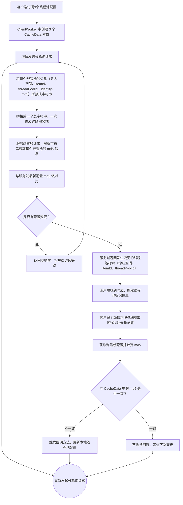

客户端向服务端发送请求，服务端并不会立刻回复响应，而是 hold 请求，也就是把请求先挂起，等待固定的时间之后，也许是 10 秒，也许是 30 秒，再异步回复客户端响应。

在服务端挂起客户端请求的过程中，如果用户在 web 界面修改了线程池信息，那么服务端就可以直接回复客户端响应，通知客户端进行线程池配置变更。

当然，如果本次请求客户端并没有发现需要进行配置变更的线程池，客户端在收到服务端回复的空响应之后，就会立即发送新的请求，就这样循环下去即可。
这就是长轮询请求的工作模式。

