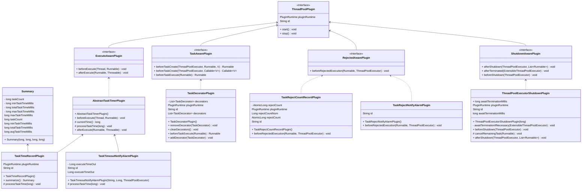

**动态线程池的扩展点以及插件体系**

------

线程池中有许多扩展点，比如说：
+ 线程池执行前后：beforeExecute()、afterExecute()
+ 线程池关闭前后：shutdown()、shutdownNow()
+ 任务拒绝前

引入插件体系：

```mermaid
classDiagram
direction BT
class AbstractTaskTimerPlugin {
  + AbstractTaskTimerPlugin() 
  + beforeExecute(Thread, Runnable) void
  # currentTime() long
  # processTaskTime(long) void
  + afterExecute(Runnable, Throwable) void
}
class ExecuteAwarePlugin {
<<Interface>>
  + beforeExecute(Thread, Runnable) void
  + afterExecute(Runnable, Throwable) void
}
class RejectedAwarePlugin {
<<Interface>>
  + beforeRejectedExecution(Runnable, ThreadPoolExecutor) void
}
class ShutdownAwarePlugin {
<<Interface>>
  + afterShutdown(ThreadPoolExecutor, List~Runnable~) void
  + afterTerminated(ExtensibleThreadPoolExecutor) void
  + beforeShutdown(ThreadPoolExecutor) void
}
class Summary {
  + Summary(long, long, long, long) 
  - long taskCount
  - long minTaskTimeMillis
  - long totalTaskTimeMillis
  - long maxTaskTimeMillis
   long maxTaskTimeMillis
   long taskCount
   long minTaskTimeMillis
   long totalTaskTimeMillis
   long avgTaskTimeMillis
}
class TaskAwarePlugin {
<<Interface>>
  + beforeTaskCreate(ThreadPoolExecutor, Runnable, V) Runnable
  + beforeTaskCreate(ThreadPoolExecutor, Callable~V~) Callable~V~
  + beforeTaskExecute(Runnable) Runnable
}
class TaskDecoratorPlugin {
  + TaskDecoratorPlugin() 
  - List~TaskDecorator~ decorators
  + removeDecorator(TaskDecorator) void
  + clearDecorators() void
  + beforeTaskExecute(Runnable) Runnable
  + addDecorator(TaskDecorator) void
   PluginRuntime pluginRuntime
   String id
   List~TaskDecorator~ decorators
}
class TaskRejectCountRecordPlugin {
  + TaskRejectCountRecordPlugin() 
  - AtomicLong rejectCount
  + beforeRejectedExecution(Runnable, ThreadPoolExecutor) void
   PluginRuntime pluginRuntime
   Long rejectCountNum
   AtomicLong rejectCount
   String id
}
class TaskRejectNotifyAlarmPlugin {
  + TaskRejectNotifyAlarmPlugin() 
  + beforeRejectedExecution(Runnable, ThreadPoolExecutor) void
   String id
}
class TaskTimeRecordPlugin {
  + TaskTimeRecordPlugin() 
  + summarize() Summary
  # processTaskTime(long) void
   PluginRuntime pluginRuntime
   String id
}
class TaskTimeoutNotifyAlarmPlugin {
  + TaskTimeoutNotifyAlarmPlugin(String, Long, ThreadPoolExecutor) 
  - Long executeTimeOut
  # processTaskTime(long) void
   String id
   Long executeTimeOut
}
class ThreadPoolExecutorShutdownPlugin {
  + ThreadPoolExecutorShutdownPlugin(long) 
  + long awaitTerminationMillis
  - awaitTerminationIfNecessary(ExtensibleThreadPoolExecutor) void
  + beforeShutdown(ThreadPoolExecutor) void
  # cancelRemainingTask(Runnable) void
  + afterShutdown(ThreadPoolExecutor, List~Runnable~) void
   PluginRuntime pluginRuntime
   String id
   long awaitTerminationMillis
}
class ThreadPoolPlugin {
<<Interface>>
  + start() void
  + stop() void
   PluginRuntime pluginRuntime
   String id
}

AbstractTaskTimerPlugin  ..>  ExecuteAwarePlugin 
ExecuteAwarePlugin  -->  ThreadPoolPlugin 
RejectedAwarePlugin  -->  ThreadPoolPlugin 
ShutdownAwarePlugin  -->  ThreadPoolPlugin 
TaskTimeRecordPlugin  -->  Summary 
TaskAwarePlugin  -->  ThreadPoolPlugin 
TaskDecoratorPlugin  ..>  TaskAwarePlugin 
TaskRejectCountRecordPlugin  ..>  RejectedAwarePlugin 
TaskRejectNotifyAlarmPlugin  ..>  RejectedAwarePlugin 
TaskTimeRecordPlugin  -->  AbstractTaskTimerPlugin 
TaskTimeoutNotifyAlarmPlugin  -->  AbstractTaskTimerPlugin 
ThreadPoolExecutorShutdownPlugin  ..>  ShutdownAwarePlugin 

```