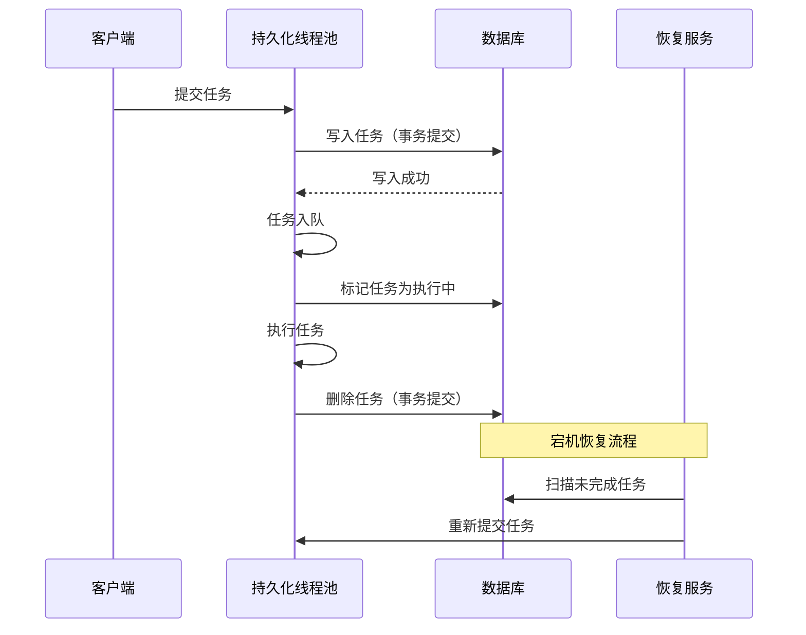
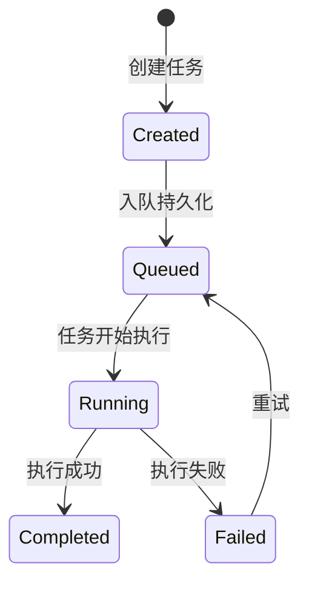

---

### 如何保证服务器宕机后线程池不丢失数据？——从理论到源码的持久化实践

---

#### 一、问题的本质

服务器宕机时，线程池中的任务（尤其是队列中等待执行或正在执行的任务）会随进程终止而丢失。这种数据丢失对金融交易、订单处理等场景是致命的。要解决这一问题，需从 **任务持久化** 和 **状态恢复** 两个维度设计可靠方案。

---

#### 二、核心挑战与解决思路

##### 1. 挑战分析
| 丢失场景          | 根本原因                     |
|-------------------|----------------------------|
| 队列中的未执行任务   | 任务仅存储于内存队列          |
| 正在执行的任务      | 线程执行中途被终止，无结果反馈 |

##### 2. 解决思路
- **持久化存储**：将任务及状态保存到可靠介质（如数据库、分布式日志）。
- **原子性操作**：任务提交、持久化、执行、删除必须保证事务性。
- **恢复机制**：服务重启时，从持久化存储中加载未完成任务。

---

#### 三、线程池的扩展点（源码视角）

##### 1. 任务提交的入口：`execute()`
```java
public void execute(Runnable command) {
    if (command == null) throw new NullPointerException();
    // 扩展点：在任务入队前持久化
    persistTask(command); 
    // ... 后续逻辑
}
```

##### 2. 钩子方法：`beforeExecute()` 与 `afterExecute()`
```java
// 任务执行前的钩子（可记录任务开始状态）
protected void beforeExecute(Thread t, Runnable r) {
    markTaskAsRunning(r);
}

// 任务执行后的钩子（可标记任务完成）
protected void afterExecute(Runnable r, Throwable t) {
    deleteTaskFromStorage(r);
}
```

##### 3. 自定义队列：持久化队列实现
```java
public class PersistentBlockingQueue extends LinkedBlockingQueue<Runnable> {
    @Override
    public boolean offer(Runnable task) {
        saveToDatabase(task); // 持久化到数据库
        return super.offer(task);
    }
}
```

---

#### 四、完整方案设计

##### 1. 架构图


##### 2. 关键组件
- **持久化存储层**：使用数据库（如MySQL）或分布式日志（如Kafka）保存任务及状态。
- **原子性保障**：通过数据库事务或消息队列的ACK机制保证持久化与业务逻辑的一致性。
- **恢复服务**：在服务启动时加载所有状态为“未完成”的任务，重新提交到线程池。

---

#### 五、源码级实现示例

##### 1. 任务定义（带唯一ID）
```java
public class PersistentTask implements Runnable {
    private final String taskId;
    private final String payload;
  
    public PersistentTask(String taskId, String payload) {
        this.taskId = taskId;
        this.payload = payload;
    }
  
    @Override
    public void run() {
        // 业务逻辑
    }
  
    public String getTaskId() { return taskId; }
}
```

##### 2. 持久化线程池
```java
public class PersistentThreadPool extends ThreadPoolExecutor {
    private final TaskStorage storage; // 持久化存储接口
  
    public PersistentThreadPool(TaskStorage storage) {
        super(corePoolSize, maxPoolSize, keepAliveTime, unit, 
              new PersistentBlockingQueue(storage));
        this.storage = storage;
    }
  
    @Override
    public void execute(Runnable command) {
        if (command instanceof PersistentTask) {
            storage.saveTask((PersistentTask) command); // 提交前持久化
        }
        super.execute(command);
    }
  
    @Override
    protected void afterExecute(Runnable r, Throwable t) {
        if (r instanceof PersistentTask) {
            storage.deleteTask(((PersistentTask) r).getTaskId()); // 执行后删除
        }
    }
}
```

##### 3. 持久化队列实现
```java
public class PersistentBlockingQueue extends LinkedBlockingQueue<Runnable> {
    private final TaskStorage storage;
  
    public PersistentBlockingQueue(TaskStorage storage) {
        this.storage = storage;
    }
  
    @Override
    public boolean offer(Runnable task) {
        if (task instanceof PersistentTask) {
            storage.markTaskAsQueued(((PersistentTask) task).getTaskId());
        }
        return super.offer(task);
    }
}
```

---

#### 六、恢复机制实现

##### 1. 服务启动时加载未完成任务
```java
public class TaskRecoveryService {
    private final TaskStorage storage;
    private final ThreadPoolExecutor executor;
  
    public void recoverTasks() {
        List<PersistentTask> unfinishedTasks = storage.loadUnfinishedTasks();
        for (PersistentTask task : unfinishedTasks) {
            executor.execute(task); // 重新提交到线程池
        }
    }
}
```

##### 2. 任务状态机


---

#### 七、注意事项与优化

##### 1. 性能优化
- **批量持久化**：合并多个任务的写入操作，减少数据库压力。
- **异步提交**：将持久化操作提交到单独线程，避免阻塞任务执行。

##### 2. 故障处理
- **幂等性设计**：确保任务重复提交不会导致数据错误。
- **死信队列**：对多次重试失败的任务单独处理。

##### 3. 存储选型对比
| 存储类型        | 优点                      | 缺点                  |
|----------------|--------------------------|----------------------|
| **关系型数据库** | 事务支持完善，查询方便     | 高并发下性能可能成瓶颈 |
| **Kafka**       | 高吞吐量，支持持久化日志   | 需要额外维护消费者位移 |
| **Redis**       | 低延迟，适合高频小任务     | 数据可靠性较低         |

---

#### 八、总结

通过扩展线程池的任务提交、队列管理和执行钩子，结合可靠的持久化存储，可构建出**抗宕机**的线程池系统。这种方案的核心在于：

1. **全链路持久化**：任务从提交到完成的每个状态变更均持久化。
2. **原子性保障**：通过数据库事务或消息队列ACK确保数据一致性。
3. **快速恢复**：服务重启时自动加载未完成任务。

实际应用中需权衡 **性能** 与 **可靠性**，根据业务场景选择合适的存储方案。在金融、电商等对数据一致性要求高的场景，此方案能有效避免灾难性数据丢失。