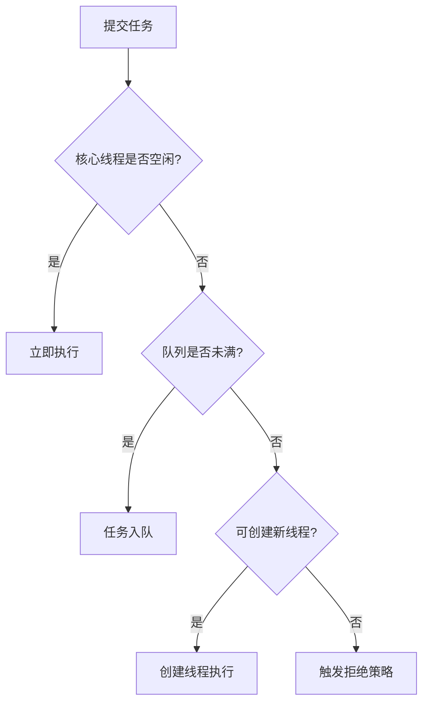

在面试中回答如何设计一个线程池时，可以按照以下结构组织回答，确保逻辑清晰且覆盖关键点：

---

### **1. 理解线程池的核心目标**
首先明确线程池的设计目的：
- **资源复用**：减少线程创建/销毁的开销。
- **流量控制**：通过队列缓冲突发请求，避免系统过载。
- **统一管理**：集中处理线程生命周期和异常。

---

### **2. 线程池的七大核心参数**
结合源码（如Java的`ThreadPoolExecutor`）解释关键参数：
```java
public ThreadPoolExecutor(
    int corePoolSize,      // 核心线程数
    int maximumPoolSize,   // 最大线程数
    long keepAliveTime,    // 非核心线程空闲存活时间
    TimeUnit unit,         // 时间单位
    BlockingQueue<Runnable> workQueue, // 任务队列
    ThreadFactory threadFactory,       // 线程工厂
    RejectedExecutionHandler handler   // 拒绝策略
)
```
#### **参数详解**
1. **核心线程数（corePoolSize）**
    - **作用**：线程池长期维持的线程数量，即使空闲也不回收（除非设置`allowCoreThreadTimeOut`）。
    - **设置依据**：
        - CPU密集型任务：`N_cpu + 1`（N_cpu为CPU核数）。
        - IO密集型任务：`N_cpu * 2`（需根据IO等待时间调整）。

2. **最大线程数（maximumPoolSize）**
    - **作用**：线程池允许创建的最大线程数。
    - **设置依据**：根据系统资源（内存、CPU）和任务类型调整，避免过多线程导致上下文切换开销。

3. **任务队列（workQueue）**
    - **常见类型**：
        - **无界队列**（如`LinkedBlockingQueue`）：可能导致内存溢出，适用于可预测任务量的场景。
        - **有界队列**（如`ArrayBlockingQueue`）：需设置合理容量，队列满后触发线程扩容。
        - **同步移交队列**（如`SynchronousQueue`）：直接传递任务，不存储，适用于高吞吐场景。

4. **拒绝策略（handler）**
    - **内置策略**：
        - `AbortPolicy`：抛出异常，建议生产环境使用以快速暴露问题。
        - `CallerRunsPolicy`：由提交任务的线程执行任务，降低提交速度。
        - `DiscardOldestPolicy`：丢弃队列中最旧任务（可能导致关键任务丢失）。
        - `DiscardPolicy`：静默丢弃新任务。
    - **自定义策略**：根据业务需求实现`RejectedExecutionHandler`，如记录日志或降级处理。

---

### **3. 线程池的工作流程**
结合流程图说明任务调度逻辑：


---

### **4. 设计中的关键考量**
#### **线程生命周期管理**
- **线程复用**：通过`Worker`类封装线程和任务，循环执行队列中的任务。
- **空闲线程回收**：非核心线程在`keepAliveTime`后终止，核心线程默认不回收（需显式设置`allowCoreThreadTimeOut=true`）。

#### **任务队列选择**
- **IO密集型任务**：建议使用较大的队列容量（如`LinkedBlockingQueue`），避免频繁创建线程。
- **高吞吐需求**：使用`SynchronousQueue`，任务直接交给线程处理，无缓冲。

#### **拒绝策略设计**
- **金融交易系统**：采用`AbortPolicy`，严格保证任务不丢失。
- **日志采集系统**：使用`DiscardPolicy`，允许丢弃部分非关键数据。
- **实时计算场景**：自定义策略，将任务暂存至外部存储（如Redis），待恢复后重试。

---

### **5. 性能调优与监控**
#### **动态调整参数**
- **运行时修改**：通过`setCorePoolSize()`和`setMaximumPoolSize()`动态扩容/缩容。
- **自适应策略**：根据监控指标（如队列积压量、平均任务耗时）自动调整参数。

#### **监控指标**
```java
// 示例：通过JMX或自定义监控接口暴露指标
int activeThreads = executor.getActiveCount();
long completedTasks = executor.getCompletedTaskCount();
int queueSize = executor.getQueue().size();
```

---

### **6. 实际案例：电商秒杀系统**
#### **场景需求**
- 瞬时高并发请求（如10万QPS）。
- 任务处理时间短（平均50ms）。
- 允许部分请求降级（如返回“稍后再试”）。

#### **线程池设计**
- **参数配置**：
    - `corePoolSize=50`，`maximumPoolSize=200`。
    - 使用`ArrayBlockingQueue`，容量=1000。
    - 拒绝策略：自定义降级策略，将超限请求写入Redis等待重试。
- **优势**：
    - 队列缓冲突发流量，避免服务崩溃。
    - 拒绝策略保障核心交易链路稳定。

---

### **7. 避免常见误区**
- **误区1**：盲目使用无界队列 → 导致内存溢出。
  **解决**：根据系统内存和任务量设置合理队列大小。
- **误区2**：最大线程数设置过高 → 上下文切换开销大。
  **解决**：通过压测确定最佳线程数（如使用Jmeter）。
- **误区3**：忽略线程池的异常处理 → 任务静默失败。
  **解决**：重写`afterExecute()`方法，捕获并记录异常。

---

### **回答示例**
“设计线程池时，首先需要明确业务场景的特点，比如任务是CPU密集型还是IO密集型，预期的QPS是多少，允许的任务延迟范围等。接着，根据这些需求配置核心参数：核心线程数、最大线程数、任务队列类型和容量、拒绝策略。例如，一个电商秒杀系统可能需要较大的最大线程数，配合有界队列缓冲突发流量，同时自定义拒绝策略将超限请求降级。此外，还需考虑线程的复用机制和空闲回收策略，避免资源浪费。最后，通过监控线程池的运行指标（如活跃线程数、队列积压量），动态调整参数以实现最优性能。”

---

通过以上结构化的回答，不仅能展示对线程池设计的全面理解，还能体现结合实际场景的工程化思维，从而在面试中脱颖而出。