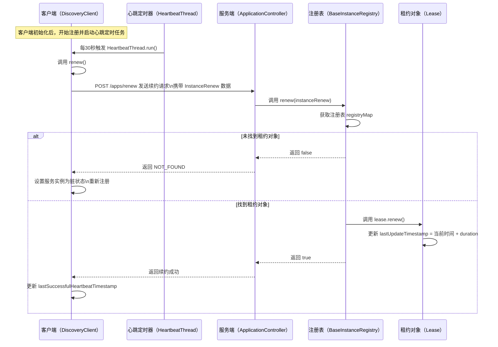

在 `DiscoveryClient` 中新增一个定时任务，该定时任务每 30 秒就会执行一次 HeartbeatThread 任务，也就是向服务端进行续约操作。
真正续约的操作就被定义在 renew() 方法中，在该方法中实际上就是创建了一个 InstanceRenew 对象，这个对象封装了客户端的核心信息，然后把这个对象发送给服务端即可。

```java
@Data
@Accessors(chain = true)
public static class InstanceRenew {

    private String appName;

    private String instanceId;

    private String lastDirtyTimestamp;

    private String status;
}   
```


------

### 心跳检测（续约）流程图



------

### 📝 简要说明：

1. **心跳任务启动：**
    客户端 `DiscoveryClient` 初始化时注册服务并启动 `HeartbeatThread` 定时器。
2. **定时续约：**
    每隔 30 秒（可调整为 1 秒进行测试）发送续约请求到服务端 `/apps/renew`。
3. **服务端处理：**
    服务端 `ApplicationController` 接收到续约请求后，交由 `BaseInstanceRegistry` 执行核心逻辑。
4. **续约逻辑：**
    注册表中找到对应租约对象 `Lease`，调用其 `renew()` 方法更新 `lastUpdateTimestamp`。
5. **容错处理：**
    如果服务端未找到租约对象，客户端会将服务实例标记为脏并重新注册。

