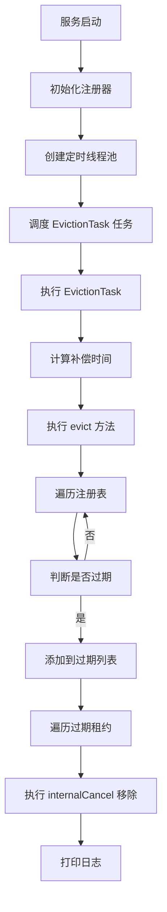

服务端只需启动一个定时任务，定期扫描注册表，检查服务实例是否已过期。对于检测到的过期实例，直接将其从注册表中移除，从而实现服务实例的自动剔除机制。

```mermaid

flowchart TD

Start[服务启动]
Init[初始化注册器]
CreateScheduler[创建定时线程池]
ScheduleTask[调度 EvictionTask 任务]

EvictionRun[执行 EvictionTask]
ComputeTime[计算补偿时间]
CallEvict[执行 evict 方法]
IterateRegistry[遍历注册表]
CheckExpired[判断是否过期]
AddToExpired[添加到过期列表]
IterateExpired[遍历过期租约]
Cancel[执行 internalCancel 移除]
LogInfo[打印日志]

Start --> Init --> CreateScheduler --> ScheduleTask --> EvictionRun
EvictionRun --> ComputeTime --> CallEvict --> IterateRegistry
IterateRegistry --> CheckExpired

CheckExpired -->|是| AddToExpired
CheckExpired -->|否| IterateRegistry

AddToExpired --> IterateExpired --> Cancel --> LogInfo

```

