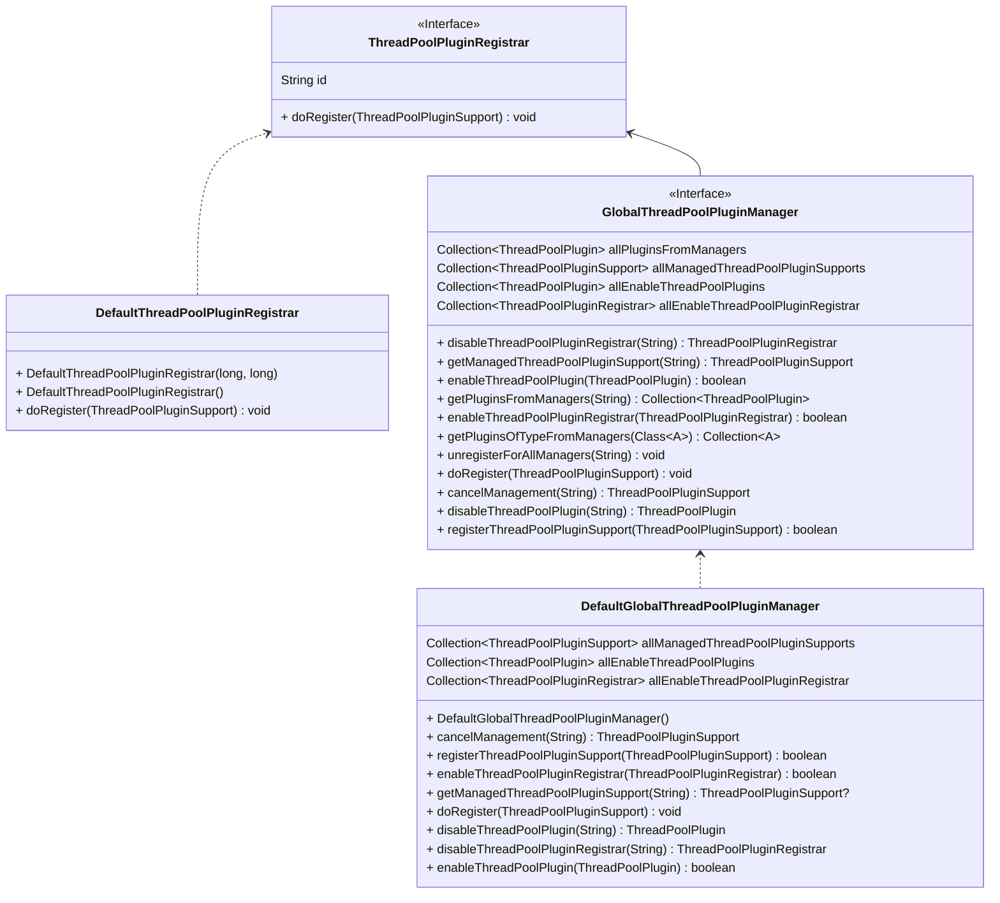

为了方便用户在使用动态线程池时，无需每次都显示注册线程池插件，moirai 提供了默认线程池插件注册功能。

```mermaid
classDiagram
direction BT
class DefaultGlobalThreadPoolPluginManager {
+ DefaultGlobalThreadPoolPluginManager()
+ cancelManagement(String) ThreadPoolPluginSupport
+ registerThreadPoolPluginSupport(ThreadPoolPluginSupport) boolean
+ enableThreadPoolPluginRegistrar(ThreadPoolPluginRegistrar) boolean
+ getManagedThreadPoolPluginSupport(String) ThreadPoolPluginSupport?
+ doRegister(ThreadPoolPluginSupport) void
+ disableThreadPoolPlugin(String) ThreadPoolPlugin
+ disableThreadPoolPluginRegistrar(String) ThreadPoolPluginRegistrar
+ enableThreadPoolPlugin(ThreadPoolPlugin) boolean
  Collection~ThreadPoolPluginSupport~ allManagedThreadPoolPluginSupports
  Collection~ThreadPoolPlugin~ allEnableThreadPoolPlugins
  Collection~ThreadPoolPluginRegistrar~ allEnableThreadPoolPluginRegistrar
  }
  class DefaultThreadPoolPluginRegistrar {
+ DefaultThreadPoolPluginRegistrar(long, long)
+ DefaultThreadPoolPluginRegistrar()
+ doRegister(ThreadPoolPluginSupport) void
  }
  class GlobalThreadPoolPluginManager {
  <<Interface>>
+ disableThreadPoolPluginRegistrar(String) ThreadPoolPluginRegistrar
+ getManagedThreadPoolPluginSupport(String) ThreadPoolPluginSupport
+ enableThreadPoolPlugin(ThreadPoolPlugin) boolean
+ getPluginsFromManagers(String) Collection~ThreadPoolPlugin~
+ enableThreadPoolPluginRegistrar(ThreadPoolPluginRegistrar) boolean
+ getPluginsOfTypeFromManagers(Class~A~) Collection~A~
+ unregisterForAllManagers(String) void
+ doRegister(ThreadPoolPluginSupport) void
+ cancelManagement(String) ThreadPoolPluginSupport
+ disableThreadPoolPlugin(String) ThreadPoolPlugin
+ registerThreadPoolPluginSupport(ThreadPoolPluginSupport) boolean
  Collection~ThreadPoolPlugin~ allPluginsFromManagers
  Collection~ThreadPoolPluginSupport~ allManagedThreadPoolPluginSupports
  Collection~ThreadPoolPlugin~ allEnableThreadPoolPlugins
  Collection~ThreadPoolPluginRegistrar~ allEnableThreadPoolPluginRegistrar
  }
  class ThreadPoolPluginRegistrar {
  <<Interface>>
+ doRegister(ThreadPoolPluginSupport) void
  String id
  }

DefaultGlobalThreadPoolPluginManager  ..>  GlobalThreadPoolPluginManager
DefaultThreadPoolPluginRegistrar  ..>  ThreadPoolPluginRegistrar
GlobalThreadPoolPluginManager  -->  ThreadPoolPluginRegistrar 
```
