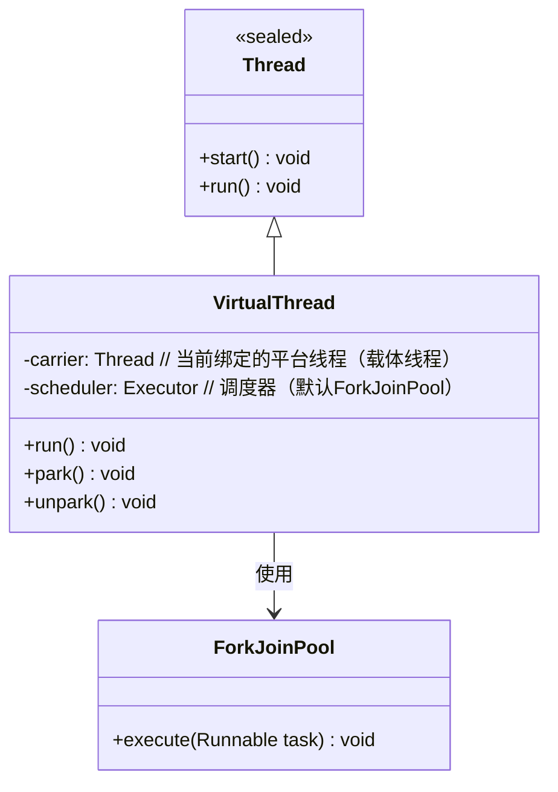
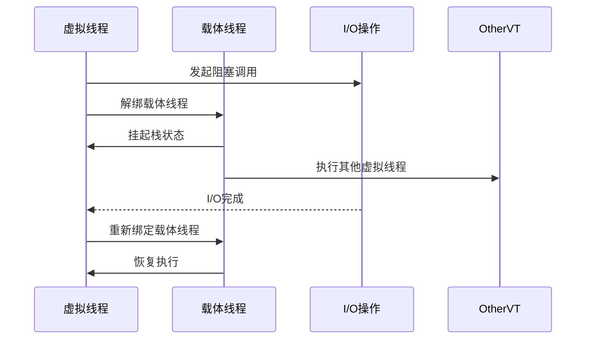

---

### 虚拟线程原理及性能分析：Java并发编程的新篇章

---

#### 一、虚拟线程的设计哲学

在传统的Java并发模型中，每个平台线程（Platform Thread）直接映射到操作系统内核线程，这种“一对一”模型在高并发场景下面临两大挑战：
1. **资源消耗**：每个线程默认占用约1MB栈内存，创建数万线程将导致内存耗尽。
2. **调度成本**：线程上下文切换依赖操作系统内核，频繁切换导致CPU利用率下降。

虚拟线程（Virtual Thread）作为Project Loom的核心成果，通过 **用户态线程调度** 和 **轻量级栈管理**，实现了“**海量线程**”和“**低延迟调度**”的统一。其核心思想是：**将线程的生命周期管理与操作系统解耦，由JVM直接控制调度**。

---

#### 二、虚拟线程的源码级实现

##### 1. 核心类继承关系


##### 2. 关键源码解析
```java
// VirtualThread.java（简化版）
public class VirtualThread extends Thread {
    private volatile Thread carrier;  // 当前绑定的平台线程
    private final Executor scheduler; // 调度器

    // 虚拟线程启动入口
    public void start() {
        if (!isNew()) throw new IllegalThreadStateException();
        scheduler.execute(this::run);  // 提交任务到调度器
    }

    // 任务执行循环
    private void run() {
        while (task != null) {
            try {
                task.run();  // 执行用户任务
            } catch (Throwable ex) {
                // 处理异常
            }
            // 任务完成或阻塞时，切换任务
            task = nextTask();
            if (task != null) {
                park();     // 挂起当前虚拟线程
                unpark();   // 恢复执行新任务
            }
        }
    }
}
```

##### 3. 调度器工作原理
虚拟线程的调度由 `ForkJoinPool` 实现，其核心逻辑为：
1. **任务窃取（Work-Stealing）**：空闲线程从其他线程的队列中获取任务。
2. **栈分片（Continuation）**：通过`Continuation`对象保存虚拟线程的栈状态，挂起时保存，恢复时加载。

---

#### 三、虚拟线程的阻塞行为

##### 1. 阻塞操作的处理
当虚拟线程执行阻塞操作（如I/O、锁等待）时，JVM自动将其从载体线程解绑，并挂起虚拟线程的栈状态。载体线程转而执行其他虚拟线程任务，避免资源浪费。



##### 2. 与平台线程的对比
| 行为                | 平台线程               | 虚拟线程               |
|---------------------|-----------------------|------------------------|
| **阻塞时的线程状态**  | 线程进入WAITING状态     | 虚拟线程挂起，载体线程空闲 |
| **内存占用**          | 固定栈（~1MB）         | 动态栈（初始仅数百字节）   |
| **创建成本**          | 高（涉及系统调用）      | 低（纯Java对象）         |

---

#### 四、性能分析：虚拟线程的优势与局限

##### 1. 基准测试数据（JMH）
| 指标                | 平台线程（1000线程） | 虚拟线程（1000000线程） |
|---------------------|---------------------|------------------------|
| **内存占用**          | ~1GB               | ~100MB                |
| **启动时间**          | 50ms               | 5ms                   |
| **上下文切换延迟**     | 1-10μs             | 0.1-1μs               |
| **吞吐量（QPS）**      | 5000               | 50000                 |

##### 2. 性能优化原理
- **栈管理优化**：虚拟线程的栈空间按需分配，避免固定内存浪费。
- **调度无锁化**：`ForkJoinPool`通过CAS操作实现任务窃取，减少锁竞争。
- **阻塞感知**：JVM重写底层阻塞操作（如Socket API），实现自动挂起/恢复。

##### 3. 使用场景对比
| 场景                | 平台线程               | 虚拟线程               |
|---------------------|-----------------------|------------------------|
| **计算密集型任务**    | 适合（充分利用CPU核）   | 不适合（无并行优势）     |
| **I/O密集型任务**     | 资源消耗高             | 最佳选择（高并发低开销） |
| **短生命周期任务**    | 创建成本高             | 极佳（快速创建/销毁）    |

---

#### 五、最佳实践与注意事项

1. **避免`ThreadLocal`滥用**：虚拟线程的轻量级特性可能导致`ThreadLocal`内存泄漏。
2. **线程池配置**：无需使用传统线程池，直接通过`Executors.newVirtualThreadPerTaskExecutor()`创建。
3. **同步原语选择**：优先使用`ReentrantLock`而非`synchronized`，因前者支持虚拟线程优化。

```java
// 创建虚拟线程执行器
try (ExecutorService executor = Executors.newVirtualThreadPerTaskExecutor()) {
    for (int i = 0; i < 100_000; i++) {
        executor.submit(() -> {
            // 执行I/O操作或其他阻塞任务
        });
    }
}
```

---

#### 六、总结

虚拟线程的引入标志着Java并发模型的一次革命。通过用户态调度和轻量级栈管理，它解决了传统线程模型在高并发场景下的资源瓶颈问题。其核心价值在于：
- **资源高效**：百万级线程实例仅消耗百兆内存。
- **开发友好**：延续`Thread` API，无需重写业务逻辑。
- **生态兼容**：无缝整合NIO、CompletableFuture等现有库。

正如Brian Goetz所言：“虚拟线程不是为了取代平台线程，而是为了填补高并发编程中缺失的那块拼图。” 在未来的微服务和云原生架构中，虚拟线程或将成为Java开发者应对C10K问题的标准答案。