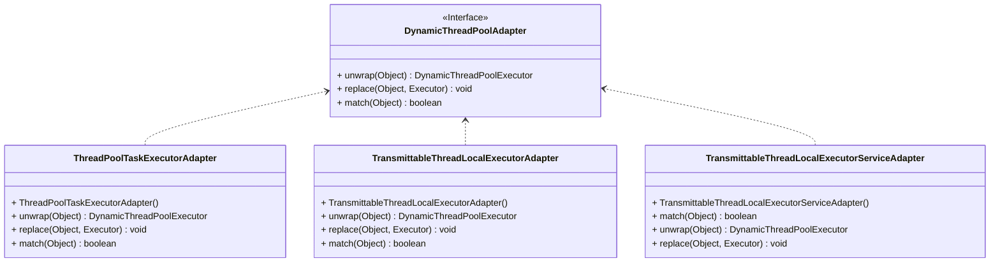

当我们将线程池包装成第三方线程池，但又使用了 `@DynamicThreadPool`注解了该线程池，比如：

```java
    @Bean
    @DynamicThreadPool
    public Executor messageConsumeTtlDynamicThreadPool() {
        String threadPoolId = "message-consume";
        ThreadPoolExecutor customExecutor = ThreadPoolBuilder.builder()
                .dynamicPool()
                .threadFactory(threadPoolId)
                .threadPoolId(threadPoolId)
                .executeTimeOut(800L)
                .waitForTasksToCompleteOnShutdown(true)
                .awaitTerminationMillis(5000L)
                .taskDecorator(new TaskTraceBuilderHandler())
                .build();
        //在这里使用Transmittable-Thread-Local包装了动态线程池
        //返回给用户Transmittable-Thread-Local框架中的线程池对象
        Executor ttlExecutor = TtlExecutors.getTtlExecutor(customExecutor);
        return ttlExecutor;
    }    
```
此时我们就需要使用反射获取到原始的线程池对象，再构建出动态线程池，最终注册到服务端。

```java
public static DynamicThreadPoolExecutor unwrap(Object executor) {
        Optional<DynamicThreadPoolAdapter> dynamicThreadPoolAdapterOptional = DYNAMIC_THREAD_POOL_ADAPTERS.stream().filter(each -> each.match(executor)).findFirst();
        return dynamicThreadPoolAdapterOptional.map(each -> each.unwrap(executor)).orElse(null);
    }
```

具体可以看下：`top.panson.core.executor.support.adpter.DynamicThreadPoolAdapter`


